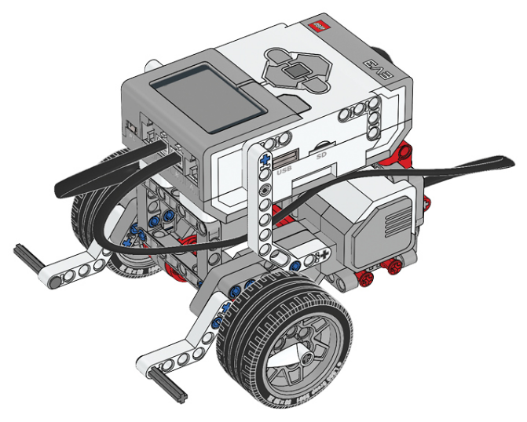

# Prvý robot

V tejto časti budeme pracovať s veľmi jednoduchým robotom, bude mať len dva
motory, aby sa vedel pohybovať. Návod na stavbu robota nájdete [tu](https://education.lego.com/v3/assets/blt293eea581807678a/bltc8481dd2666822ff/5f8801e3f4f4cf0fa39d2fef/ev3-rem-driving-base.pdf).
V simulátori mu odpovedá toto [prostredie](https://gears.aposteriori.com.sg/index.html?worldJSON=https%3A%2F%2Fraw.githubusercontent.com%2Fvargac%2FBrno-SDB-Robotika%2Fmaster%2Fassets%2FgridMap.json&robotJSON=https%3A%2F%2Fraw.githubusercontent.com%2Fvargac%2FBrno-SDB-Robotika%2Fmaster%2Fassets%2Frobot_2motors.json).



## Program pre robota

???+ example "Program"
    ``` py linenums="1"
    --8<-- "docs/2motors/intro.py"
    ```

## Spustenie programu

=== "V robotovi"

    Nyní se naučíme jak program nahrát do robota. Otevřete si stránku
    [https://xlcteam.github.io/RLLR/04/](https://xlcteam.github.io/RLLR/04/)
    a přibližně v polovině stránky najdeme
    postup na více kroků. Začneme od kroku 7: "Teraz zapneme EV3-kocku..."
    a skončíme krokem 12.

=== "V simulátori"
    Skopírujte [kód](#program-pre-robota) napísaný vyššie do záložky "Python"
    v simulátori. Návod na spustenie programu
    [tu](/simulator/#spustenie-programu).
    !!! warning "Varovanie"
        Môže nastať problém, keď simulátor nedobre napodobňuje robota v realite.
        Má veľkú zotrvačnosť a po vypnutí motorov sa robot (v simulátori) aj tak
        stále hýbe vpred, hoci reálny robot by stál na mieste. Riešením je
        prepísať všetky `.stop()` na `.hold()`. To zaručí, že sa kolesá už
        nebudú ďalej hýbať zotrvačnosťou.
